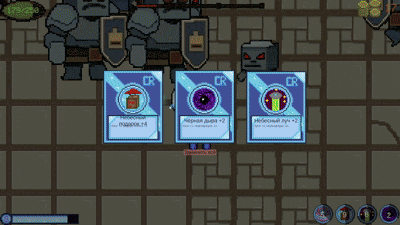
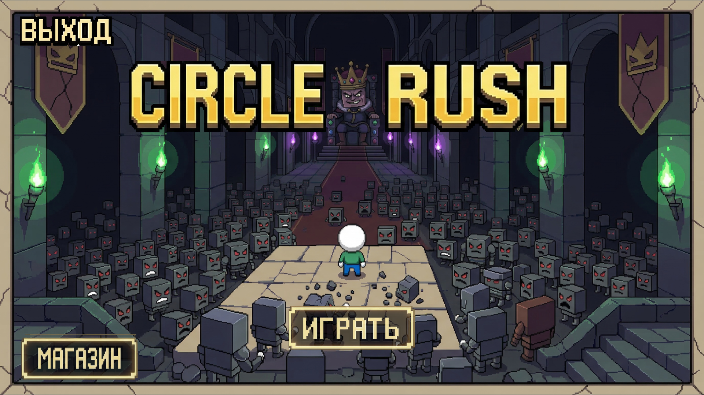
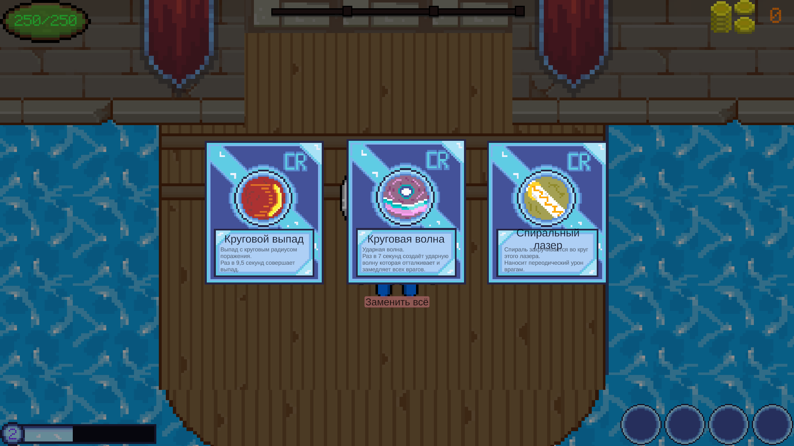
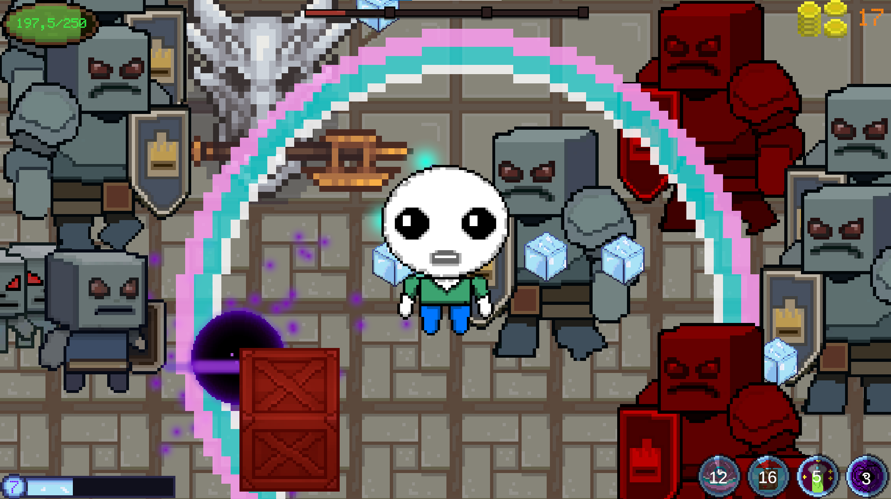
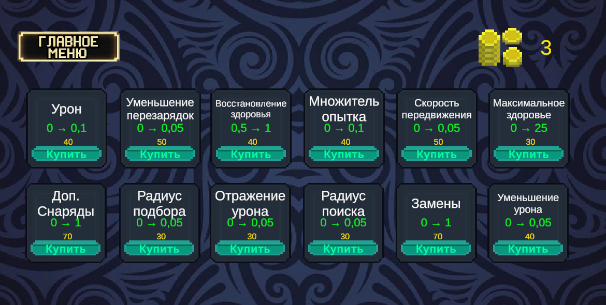

# 🎮 Circle Rush

[](https://tortikghst.itch.io/circle-rush)


<h3 align="center">
  <b>2D Bullet Heaven на Unity</b><br>
  <i>От простолюдина из Circle — до мести королю Square</i>
</h3>

<p align="center">
  <b>▶️ <a href="https://tortikghst.itch.io/circle-rush">Играть в браузере на itch.io</a></b>
</p>

---

## 🎮 О игре

**Circle Rush** — 2D-игра в жанре **Bullet Heaven**, разработанная на Unity.
Главный герой — простолюдин из королевства **Circle**, чей народ был уничтожен армией короля **Square**. Движимый местью, он отправляется в опасное путешествие, чтобы сразиться с бесчисленными врагами и восстановить справедливость.

> 🏆 Проект защищён как проектная работа с оценкой **«отлично»**.

---

## 🎥 Геймплей

<p align="center">
  
</p>

---

## ✨ Особенности

- ⚔️ **12 уникальных навыков** — от орба до спирального лазера, каждый прокачивается до 10 уровня
- 🛒 **Магазин постоянных улучшений** — 12 типов, сохраняется между сессиями
- 👾 **6 типов врагов** — лёгкий, средний, тяжёлый и их искажённые версии
- 👑 **4 босса** — гончая, шут, капитан и сам король Square
- 📈 **Прогрессия в забеге** — опыт, уровни, выбор навыков
- 🔄 **Замена навыков** — до 3 раз за игру
- 💾 **Сохранение прогресса** — через PlayerPrefs
- 🎵 **Звуковое сопровождение** — музыка и звуковые эффекты

---

## 🖼️ Скриншоты

| Главное меню | Выбор навыков |
|:-:|:-:|
|  |  |

| Геймплей | Магазин |
|:-:|:-:|
|  |  |

---

## 🛠️ Технологии

<p align="center">
  
  
  
  
  
</p>

---

## 🏗️ Архитектура

Проект построен по модульному принципу:

| Модуль | Скрипты | Назначение |
|--------|---------|------------|
| **Навыки** | `SkillData`, `SkillInstance`, `SkillManager` | Система навыков через ScriptableObject |
| **Здоровье** | `Health`, `HealthRegen`, `DamageReflect` | Система здоровья, регенерации и отражения урона |
| **Волны** | `WaveManager`, `SimpleEnemy`, `SimpleEnemy2Dir` | Управление волнами врагов с ростом сложности |
| **Магазин** | `ShopManager`, `ShopUpgrade`, `UpgradeCard` | Система постоянных улучшений |
| **Звук** | `AudioManager` | Централизованное управление музыкой и SFX |
| **Экономика** | `GoldManager`, `CoinManager`, `RunReward` | Двухуровневая экономика (забег / глобально) |
| **UI** | `SkillSelectionUI`, `EndGameMenu`, `MainMenu` | Интерфейсы игры |

---

## 🚀 Запуск проекта

### Требования

- **Unity 6** (или выше)
- **Windows 10/11**
- **Git** (для клонирования)

### Установка

```bash
# Клонируй репозиторий
git clone https://github.com/tortikghst/CirclRush.git

# Открой через Unity Hub → Add Project
# Выбери сцену: Assets/Scenes/main.unity
# Нажми Play ▶️
Сборка
text
File → Build Settings → Build (Ctrl+B)
📦 Скачать игру
<p align="center"> <a href="https://tortikghst.itch.io/circle-rush">  </a> </p><p align="center"> <b>▶️ <a href="https://tortikghst.itch.io/circle-rush">tortikghst.itch.io/circle-rush</a></b><br> <i>Игра доступна прямо в браузере — установка не требуется. Unity WebGL.</i> </p>
📄 Лицензия
Проект распространяется по лицензии MIT. Подробности — в файле LICENSE.

Сторонние ассеты
Тип	Источник	Лицензия
🎵 Музыка	OpenGameArt.org	CC0 / CC-BY
🔊 Звуки	Freesound.org	CC0
🔤 Шрифт	Press Start 2P	SIL Open Font License
👤 Автор
<table align="center"> <tr> <td align="center"> <a href="https://github.com/tortikghst"> <br> <sub><b>tortikghst</b></sub> </a> </td> </tr> </table><p align="center"> <a href="https://github.com/tortikghst">  </a> <a href="https://tortikghst.itch.io">  </a> </p><p align="center"> <i>⭐ Если проект понравился — поставь звезду на GitHub!</i><br> <i>🎮 Хочешь поиграть? Загляни на <a href="https://tortikghst.itch.io/circle-rush">itch.io</a>!</i> </p> ```
